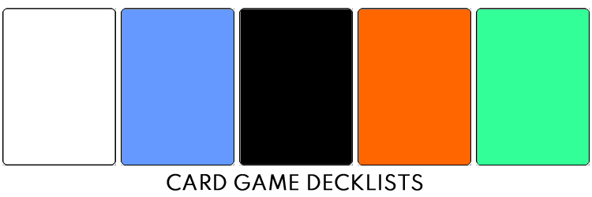

<!--
  project-templates 201024
  card-game-decklists 201024
-->

<h3 align="center">

  
   
  Decklists for card games
   

</h3>

<!-- NOTE: The HTML indentations have to stay this way to work. -->
<table>
<tr>
<td img src="repository-data/image/document/readme/spacer.png" alt="blank-spacer" width="1000" height="1">

  ### CONTENTS
  [ABOUT](#about) 
  [MAGIC THE GATHERING](#magic-the-gathering) 
  [DEVELOPMENT](#development) 
  
</td>
</tr>
</table>

<!-- About this repository -->
# ABOUT
This is a collection of decklists for various card games.

# MAGIC THE GATHERING
[Magic: The Gathering](https://en.wikipedia.org/wiki/Magic:_The_Gathering) is a collectible and digital collectible card game created by Richard Garfield and released in 1993 by Wizards of the Coast.first

Decklists

* [Cube](https://github.com/APrettyCoolProgram/card-game-decklists/tree/master/magic-the-gathering/cube)
* [Current](https://github.com/APrettyCoolProgram/card-game-decklists/tree/master/magic-the-gathering/current)
* [Draft](https://github.com/APrettyCoolProgram/card-game-decklists/tree/master/magic-the-gathering/draft)
* [Experimental](https://github.com/APrettyCoolProgram/card-game-decklists/tree/master/magic-the-gathering/experimental)
* [Jumpstart](https://github.com/APrettyCoolProgram/card-game-decklists/tree/master/magic-the-gathering/jumpstart)
* [Paper](https://github.com/APrettyCoolProgram/card-game-decklists/tree/master/magic-the-gathering/paper)
* [Work In Progress](https://github.com/APrettyCoolProgram/card-game-decklists/tree/master/magic-the-gathering/work-in-progress)

Other information

* [Concepts & Ideas](https://github.com/APrettyCoolProgram/card-game-decklists/tree/master/magic-the-gathering/concepts-and-ideas.md)
* [Data notes](https://github.com/APrettyCoolProgram/card-game-decklists/tree/master/magic-the-gathering/data-notes.md)

# DEVELOPMENT
A blurb about development can go here.

* [Project homepage](https://github.com/github-account/repository-name)
* [Changelog](repository-data/doc/changelog.md)
* [Roadmap](repository-data/doc/roadmap.md)
* [Acknowledgements](repository-data/doc/acknowledgements.md)
* [Notices](repository-data/doc/third-party-notices.md)
* [Related projects](repository-data/doc/related-projects.md)
* [Additional reading](repository-data/doc/additional-reading.md)

### Repository
* [Issues](https://github.com/github-account/repository-name/issues)
* [Projects](https://github.com/github-account/repository-name/projects)
* [Wiki](https://github.com/github-account/repository-name/wiki)
* [Insights](https://github.com/github-account/repository-name/pulse)

***

<!-- DEVELOPMENT FOOTER -->
&nbsp;&nbsp;&nbsp;&nbsp; 
